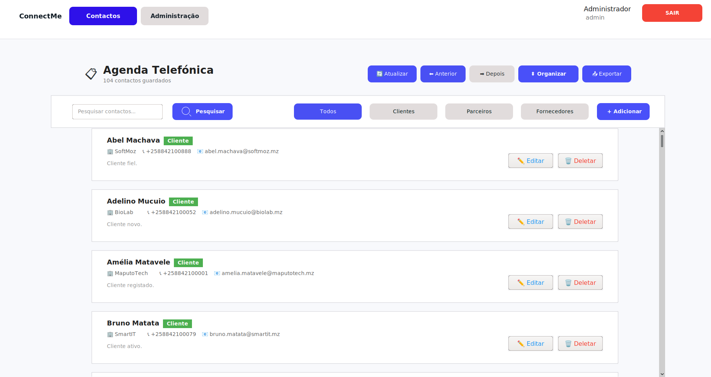
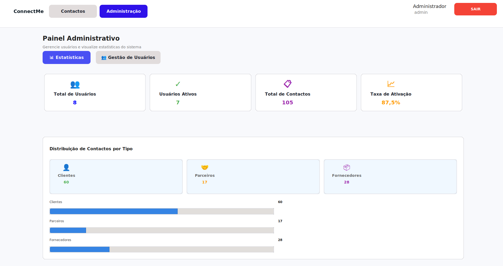

# 📇 ConnectMe - Sistema de Agenda Telefónica Digital

Sistema robusto de gestão de contactos desenvolvido com base em Estruturas de Dados e Algoritmos (EDA), implementando pesquisa eficiente, ordenação avançada e persistência de dados.

## 📋 Sobre o Projeto

ConnectMe é um sistema de agenda telefónica digital desenvolvido para modernizar o processo de gestão de contactos, centralizando informações que anteriormente encontravam-se dispersas em documentos e folhas de cálculo.

## 📸 Screenshots

<div align="center">
  
  
</div>

## ✨ Funcionalidades

- ✅ **Gestão de Contactos**: Inserção, edição, remoção e visualização
- 🔍 **Pesquisa Avançada**: Por nome ou número com alta performance
- 📊 **Ordenação**: Alfabética utilizando MergeSort
- 📤 **Exportação**: PDF, TXT e HTML
- 🔐 **Autenticação Segura**: Login com senha criptografada (SHA-256)
- ↩️ **Undo/Redo**: Desfazer e refazer ações através de Stacks
- 👥 **Gestão de Utilizadores**: Painel administrativo completo

## 🏗️ Arquitetura

O sistema utiliza o padrão **MVC (Model-View-Controller)** para separação de responsabilidades:

```
├── Model (Dados e Lógica de Negócio)
│   ├── entities/      # Contact, User
│   ├── dao/           # Data Access Objects
│   ├── eda/           # Estruturas de Dados
│   └── service/       # Serviços de autenticação
│
├── View (Interface Gráfica)
│   ├── LoginScreen
│   ├── MainFrame
│   ├── ContactPanel
│   └── AdminPanel
│
└── Controller (Lógica de Controlo)
    ├── AuthController
    ├── ContactController
    └── ExportController
```

## 🛠️ Tecnologias Utilizadas

### Backend
- **Java SE 21**
- **JDBC** para conexão com base de dados
- **MySQL** para persistência de dados
- **HikariCP** para pool de conexões

### Frontend
- **Java Swing** para interface gráfica
- **FlatLaf** para tema moderno
- **MigLayout** para layouts responsivos

### Bibliotecas
- **iText 7** para geração de PDF
- **JUnit 5** para testes unitários
- **H2 Database** para testes

## 📊 Estruturas de Dados Implementadas

| Estrutura | Aplicação | Complexidade |
|-----------|-----------|--------------|
| **ArrayList** | Armazenamento dinâmico de contactos | O(1) acesso |
| **Lista Ligada** | Inserção e remoção dinâmica | O(1) inserção |
| **Árvore Binária de Pesquisa (BST)** | Pesquisa eficiente por nome | O(log n) média |
| **Tabela Hash** | Acesso rápido por email/telefone | O(1) média |
| **Stack** | Undo/Redo e histórico de operações | O(1) |

## 🔍 Algoritmos Implementados

### Pesquisa
- **Pesquisa Linear**: Para listas não ordenadas
- **Pesquisa Binária**: Para listas ordenadas

### Ordenação
- **MergeSort**: Ordenação estável

## ⚙️ Instalação e Configuração

### Pré-requisitos

- Java JDK 21+
- MySQL 8.0+
- Maven 3.8+

### Passos de Instalação

1. **Clone o repositório**
```bash
git clone https://github.com/daLka602/Project_EDA.git
cd Project_EDA
```

2. **Configure a base de dados**
```bash
mysql -u root -p < sql/create_db.sql
```

3. **Configure a conexão com a base de dados**

Edite o arquivo `src/main/java/com/connectme/config/DbConnection.java` e ajuste as credenciais:

```java
private static final String URL = "jdbc:mysql://localhost:3306/connectme";
private static final String USER = "seu_usuario";
private static final String PASSWORD = "sua_senha";
```

4. **Compile e execute**
```bash
mvn clean install
mvn exec:java
```

5. **Acesso ao Sistema**

Use as credenciais de teste para fazer login:

**Administrador:**
- Username: `admin`
- Password: `admin123`

**Utilizador Normal:**
- Username: `staff`
- Password: `staff123`
```

## 👥 Equipa de Desenvolvimento

**Grupo 9 - EDA | Universidade Eduardo Mondlane**

| Membro | Responsabilidade |
|--------|------------------|
| **Falaque, Dalton Gomes Lauter** | Backend & Database |
| **Guirruta, Fauzia Henrique** | Relatório |
| **Laice, Luqman Adamo** | Design (Figma) |
| **Melo, Lucas José** | Relatório |
| **Mirine, Luís Alves** | Frontend & Slides |

**Docente**: Cristalino Maculuve

## 📈 Resultados Alcançados

- ✅ Pesquisa rápida através de BST e Hash Tables
- ✅ Inserção consistente com bloqueio de emails duplicados
- ✅ Ordenação eficaz com QuickSort e MergeSort
- ✅ Funcionalidade Undo/Redo implementada com Stacks
- ✅ Interface simples e funcional
- ✅ Exportação correta para PDF, TXT e HTML
- ✅ Autenticação segura com SHA-256

## 📝 Licença

Este projeto foi desenvolvido como trabalho académico para a disciplina de Estruturas de Dados e Algoritmos (EDA) da Faculdade de Engenharia da Universidade Eduardo Mondlane.

## 📞 Contacto

Para questões ou sugestões, contacte a equipa através do repositório do GitHub.

---
